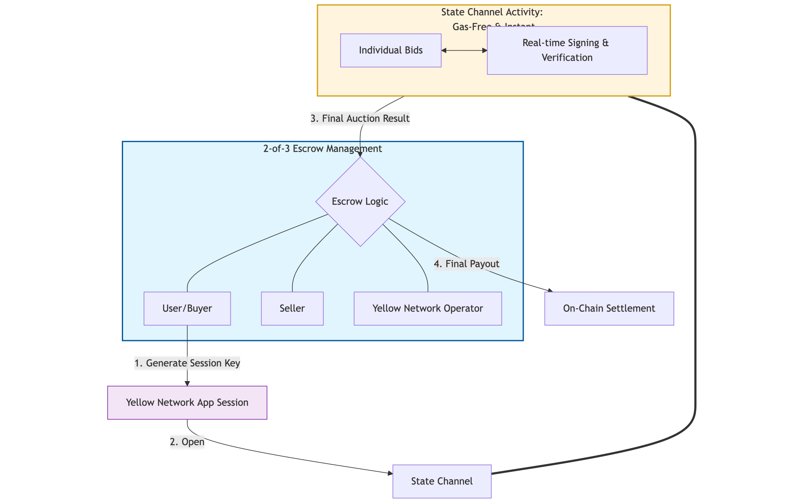

# 🤩 Yellow Penny Auction

## Live App

https://hackmoney-chi.vercel.app/

## Youtube Demo

https://youtu.be/0_i5g-EDyQ8

## Short description

Lightning-fast penny auctions powered by Yellow Network state channels.

## Description

This project is a live penny-auction experience built for the Yellow Network. Users connect a wallet, open a state-channel session, and place rapid bids without waiting for on-chain confirmations. Each $1 bid raises the price by $0.01 and resets the timer. When the timer hits zero, the last bidder wins and pays the final price; the seller keeps all bid fees. Buyers can win premium items for far less than retail, while sellers benefit from higher engagement and revenue through competitive bidding. Yellow Network state channels and app sessions keep every bid signed, verified, and confirmed in real time for instant, secure settlement.

## How it's made

Built on Yellow Network state channels, this system moves the entire auction process off-chain to provide an instant, gas-free experience. When a user joins, they open a state-channel session and generate a session key. This allows them to place rapid-fire bids without ever seeing a wallet pop-up or waiting for a blockchain confirmation.

Every individual bid and the final payout are managed directly within the state channel, ensuring that every move is signed and verified in real time. To keep the process honest, the session is protected by a 2-of-3 escrow system involving the buyer, the seller, and the operator. This setup ensures that no one can cheat the system, as any final settlement requires agreement between the parties, making the auction both lightning-fast and mathematically secure.

I also conducted an experiment integrating State Channels with Sui to assess the feasibility of integrating Yellow Network with Sui. Details are available here.

https://github.com/proofoftofu/hackmoney/tree/main/experiments/sui
