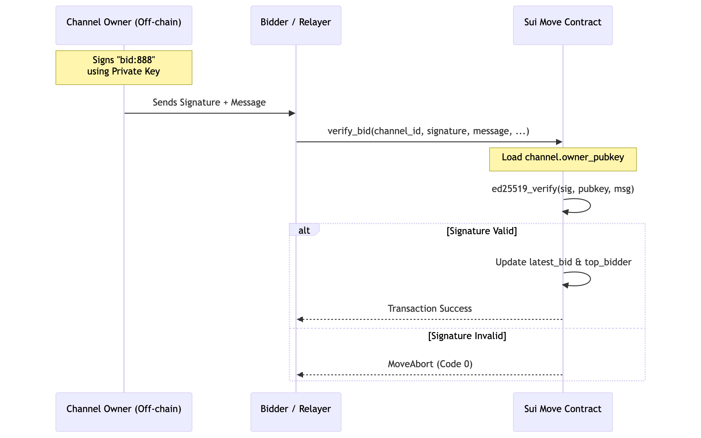

## Sui Integration

### Deployment

```
[published.testnet]
chain-id = "4c78adac"
published-at = "0xdea9a34e90c69450d02a172b03ebc1be25959a48e4f1e9722f4dbae9d7e4643e"
original-id = "0xdea9a34e90c69450d02a172b03ebc1be25959a48e4f1e9722f4dbae9d7e4643e"
version = 1
toolchain-version = "1.65.1"
build-config = { flavor = "sui", edition = "2024" }
upgrade-capability = "0x3c22c598a083484da5cfda39c4b2e3e2d0301b0aa843ffb664befbbacabfb659"
```

### To Test

```
cd integration_test

# Create .env file and update
SUI_PRIVATE_KEY=

npx ts-node test.ts
```

### Created Tx

#### Initialize Channel

https://testnet.suivision.xyz/txblock/5z6crufFaMMdTQGVGJRPafEuCrr5BubKa7CGCcVrUyjC

#### Settlement

https://testnet.suivision.xyz/txblock/ipCNEYGzNWeMWZ8BdzvEkUjso4Fi1Kkebmd4DzKdrFj

### How it works



This flow utilizes Ed25519 digital signatures to verify off-chain authorizations without incurring the latency or cost of intermediate on-chain transactions. First, the channel owner signs a raw byte message—such as a specific bid amount—using their private key off-chain. This signature, the original message, and the bidder's address are then submitted to the Sui network. The verify_bid function employs the sui::ed25519::ed25519_verify native function to cryptographically match the signature against the owner_pubkey stored within the StateChannel object. Upon successful verification, the contract updates the global state with the new bid and bidder; otherwise, the transaction aborts to prevent unauthorized state changes.

### Yellow Network Integration

This implementation serves as a technical Proof of Concept (PoC) to validate state channel feasibility on Sui. While a production-grade deployment would involve updating the Yellow SDK and formalizing contract registration, this project focuses on the core cryptographic settlement layer. By utilizing Sui Move and an integration test suite, the project demonstrates that off-chain authorizations can be securely verified on-chain. This flow ensures that high-frequency state updates—such as bids—are settled using Sui’s native Ed25519 primitives, proving that the infrastructure can support the low-latency requirements of the Yellow Network.
